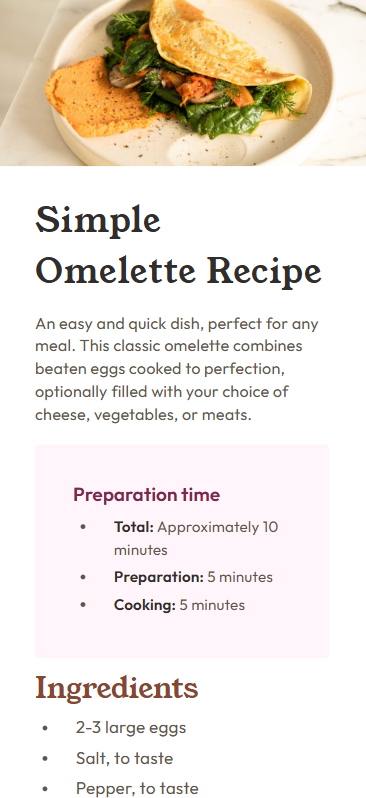

# Frontend Mentor - Recipe page solution

This is a solution to the [Recipe page challenge on Frontend Mentor](https://www.frontendmentor.io/challenges/recipe-page-KiTsR8QQKm). Frontend Mentor challenges help you improve your coding skills by building realistic projects. 

## Table of contents

- [Overview](#overview)
  - [The challenge](#the-challenge)
  - [Screenshot](#screenshot)
  - [Links](#links)
- [My process](#my-process)
  - [Built with](#built-with)
  - [What I learned](#what-i-learned)
  - [Useful resources](#useful-resources)
- [Author](#author)
- [Acknowledgments](#acknowledgments)

## Overview
### Screenshot




### Links

- Solution [here](https://github.com/odunlemi/recipe-page)
- Live Site [here](https://odunlemi.github.io/recipe-page/)

## My process

### Built with

- Semantic HTML5 markup
- CSS custom properties
- Flexbox
- Mobile-first workflow

### What I learned

For my initial attempt, I challenged myself to start with a mobile-first design, and then scale the design to larger screens. That didn't work out well as I couldn't see how I'd maintain both the mobile view and desktop version without two separate html files. I tried media queries to target different screen sizes as you can see below:

```css
/* Mobile views */
@media screen and (max-width: 399px) { }
```
```css
/* For larger screen sizes */
@media screen and (min-width: 400px) and (max-width: 799px), (min-width: 800px) { }
```

But it was just too complex. The design looked exact on mobile but on a larger screen, it was too tiny. I looked at [ddomagoj](https://www.frontendmentor.io/profile/ddominik16)'s solution which was exactly what I wanted for the larger screen sizes so I rewrote the structure of the page and most of the entire stylesheet, starting with destop view this time and just tiny changes to achieve the mobile view.

I also unfortunately ended up flexing my `body` element, as it's my rule to not apply anything beyond basic styles to my `body` but that's how it seemed to work this time.

```css
body {
    height: 100%;
    /* width: 100%;  Removed as it restricts the container from full height */
    font-family: "Outfit", sans-serif;
    line-height: var(--lh-150);

    /* In another part of the stylesheet */
    margin: 120px 0px;
    background-color: var(--stone-150);
    color: var(--stone-600);
    display: flex;
    justify-content: center;
    align-items: center;
}
```

I learnt a lot from ddomagoj's code on text formatting:
```css
/* Text formatting styles */
p {
    text-wrap: pretty; /* Adds better line wrapping and text breaking */
}
h1,
h2,
h3 {
    text-wrap: balance; /* Text wrapping for headlines */
}
p,
h1,
h2,
h3 {
    overflow-wrap: break-word; /* Avoid text overflow */
}
```

Media defaults:
```css
/* Improve media defaults */
img {
    display: block;
    max-width: 100%;
}
```

The rest of the stylesheet just follows styling according to good practices and the style I've picked up over the past few challenges. This is the media query to achieve the mobile view:
```css
@media screen and (max-width: 399px) {
    body {
        height: 100%;
        margin: 0;
        background-color: var(--white);
    }

    img {
        border-radius: 0px;
    }

    .container {
        height: 100vh;
        width: 100%;
        margin: 0;
        padding: 0;
        background-color: inherit;
    }

    .name-and-desc,
    .ingredients,
    .instructions,
    .nutrition,
    table {
        padding: 0px 40px;
    }

    .name-and-desc h1 {
        font-size: 36px;
    }

    .preparation-card {
        margin: 20px 40px;
    }
}
``` 
Which is great, because I just needed a few tweaks to achieve it after designing for the desktop version primarily. 

### Useful resources

- [CSS text-wrap: pretty](https://developer.chrome.com/blog/css-text-wrap-pretty) - From the Chrome for Developers blog, easily explained the text-wrap property to me and outlined how I used it for headings and the rest of the page's text.
- [overflow-wrap](https://developer.mozilla.org/en-US/docs/Web/CSS/overflow-wrap) - From MDN, quickly shows what the `overflow-wrap` property is; it prevents the text from overflowing its line box.

## Author

- Website - [Abiodun Longe](https://odunlemi.github.io/)
- Frontend Mentor - [@odunlemi](https://www.frontendmentor.io/profile/odunlemi)
- Twitter - [@odunlemi](https://www.x.com/odunlemi)

## Acknowledgments

Shoutout to [ddomagoj](https://www.frontendmentor.io/profile/ddominik16), reviewing your solution helped me solve this one. I couldn't find your code (as the github link was broken) but inspecting the page and looking at it through the developer tools proved helpful.
